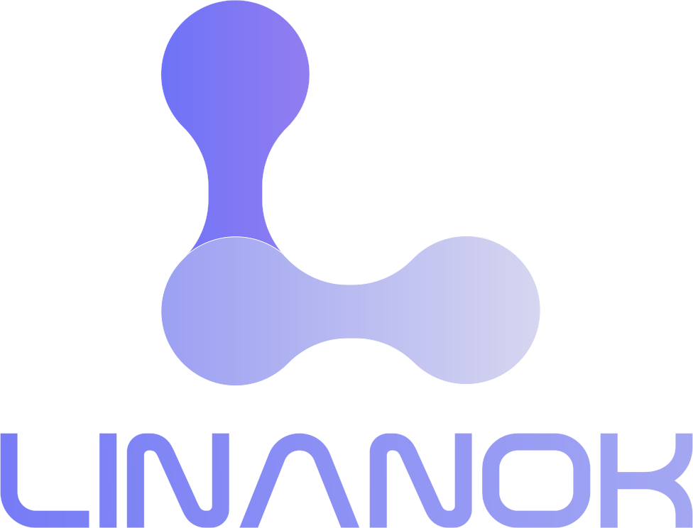

<p align="center">
  <a href="https://linanok.com" target="_blank">
    
  </a>
</p>

# Linanok

[](https://opensource.org/licenses/MIT)
[](https://github.com/orgs/Linanok/packages)
[](https://laravel.com/)

Linanok is a professional URL shortening application designed specifically for organizations and companies. It provides
a robust platform for managing and tracking shortened URLs at an enterprise level, helping businesses maintain their
brand identity while sharing concise, memorable links.

## 📋 Table of Contents

- [Features](#-features)
- [Why Linanok?](#-why-linanok)
- [Quick Start](#-quick-start)
- [Installation](#-installation)
- [Configuration](#-configuration)
- [Usage](#-usage)
- [Contributing](#-contributing)
- [Testing](#-testing)
- [License](#-license)
- [Support](#-support)

## ✨ Features

### 🔗 URL Management

- **Centralized Dashboard**: Manage all your shortened URLs from one place
- **Multiple Domain Support**: Use multiple branded domains for different departments
- **Link Expiration & Scheduling**: Set expiration dates and schedule link activation
- **Password Protection**: Secure sensitive links with password protection
- **URL Tagging**: Organize links with custom tags

### 📊 Analytics & Tracking

- **Detailed Visit Statistics**: Comprehensive analytics on link performance
- **Visitor Location Tracking**: Geographic insights into your audience
- **Device & Browser Analytics**: Understand how users access your links

### 👥 Team & Access Control

- **Role-Based Access Control (RBAC)**: Granular permissions for team members
- **Department Groups**: Organize users by departments or teams
- **Domain Ownership Management**: Assign domains to specific teams
- **User Role Management**: Flexible role assignment and management
- **Activity Logging**: Track all user actions and changes

## 🚀 Why Linanok?

Unlike typical URL shorteners designed for individual use, **Linanok** is purpose-built for organizations and teams that
need advanced management, security, and organizational features.

### Key Differentiators

- **🏢 Enterprise-Grade Access Control**: Fine-grained RBAC and permissions management
- **🌐 Multiple Domain Management**: Maintain brand consistency across departments
- **📈 Advanced Analytics**: Actionable insights for organizational decision-making
- **🔒 Enhanced Security**: Password protection, expiration, and scheduling features
- **🏷️ Custom Tagging**: Scale-friendly link organization
- **👥 Organization-Focused Design**: Built for team collaboration and enterprise workflows

## ⚡ Quick Start

The fastest way to get Linanok running:

Visit [github.com/linanok/linanok-platform](https://github.com/linanok/linanok-platform) for the quickest deployment
using our prebuilt Docker images.

## 📦 Installation

### Prerequisites

- **Docker** (version 20.10 or higher)
- **Docker Compose** (version 2.0 or higher)
- **Git** (for cloning the repository)

### Docker Installation (Recommended)

1. **Clone the repository:**
   ```bash
   git clone https://github.com/linanok/linanok.git
   cd linanok
   ```

2. **Create environment file:**
   ```bash
   cp .env.docker.example .env.docker
   ```

3. **Configure environment variables:**
   Edit the `.env.docker` file with your specific settings:
   ```env
   APP_NAME=Linanok
   APP_ENV=production
   APP_KEY=base64:aP28hHSMnZ5BDSzG1N2N4A3swRcM7+HYugXSLXoJIHc=
   APP_DEBUG=false
   APP_TIMEZONE=UTC
   APP_URL=http://localhost:8000

   OCTANE_WORKERS=8
   QUEUE_WORKER_REPLICAS=4

   TRUSTED_PROXIES=*

   APP_MAINTENANCE_DRIVER=file

   BCRYPT_ROUNDS=12

   LOG_CHANNEL=stack
   LOG_STACK=single
   LOG_DEPRECATIONS_CHANNEL=null
   LOG_LEVEL=debug

   DB_CONNECTION=pgsql
   DB_HOST=postgres
   DB_PORT=5432
   DB_DATABASE=linanok
   DB_USERNAME=postgres
   DB_PASSWORD=postgres

   SESSION_DRIVER=redis
   SESSION_LIFETIME=120
   SESSION_ENCRYPT=false
   SESSION_PATH=/
   SESSION_DOMAIN=null
 
   FILESYSTEM_DISK=local
   QUEUE_CONNECTION=database

   CACHE_STORE=redis
   CACHE_PREFIX=

   REDIS_CLIENT=predis
   REDIS_HOST=redis
   REDIS_PASSWORD=null
   REDIS_PORT=6379
   REDIS_DB=0
   REDIS_CACHE_DB=1
   REDIS_CACHE_CONNECTION=cache

   VITE_APP_NAME="${APP_NAME}"
   ```

4. **Generate application key:**
   ```bash
   docker-compose run --rm app php artisan key:generate --show
   ```
   Copy the generated key and update it in the `.env.docker` file.

5. **Start the application:**
   ```bash
   docker-compose up -d
   ```

6. **Create a super admin user:**
   ```bash
   docker-compose exec app php artisan make:super-admin
   ```

The application will be available at `http://localhost:8000`

### Manual Installation

If you prefer to install Linanok without Docker:

1. **Clone the repository:**
   ```bash
   git clone https://github.com/your-username/linanok.git
   cd linanok
   ```

2. **Install PHP dependencies:**
   ```bash
   composer install --no-dev --optimize-autoloader
   ```

3. **Install Node.js dependencies:**
   ```bash
   npm install
   npm run build
   ```

4. **Set up your database:**
    - For PostgreSQL: Create a PostgreSQL database
    - For SQLite: No setup required (database file will be created automatically)
    - Update the `.env` file with your database credentials

5. **Configure environment:**
   ```bash
   cp .env.example .env
   # Edit .env with your settings
   php artisan key:generate
   ```

6. **Run database setup:**
   ```bash
   php artisan migrate
   php artisan db:seed --class=ProductionDatabaseSeeder
   ```

7. **Set up queue worker:**
   ```bash
   php artisan queue:work
   ```

8. **Start the development server:**
   ```bash
   php artisan serve
   ```

## ⚙️ Configuration

### Environment Variables

Key configuration options in your `.env` file:

- **Database**: Configure PostgreSQL or SQLite connection settings
- **Redis**: Set up Redis for caching and queue management
- **Queue**: Set queue driver (Redis recommended for production)
- **Logging**: Configure log levels and storage

### Database Setup

Linanok supports both PostgreSQL and SQLite databases. PostgreSQL is recommended for production environments, while
SQLite is perfect for development and smaller deployments.

**For PostgreSQL**, ensure your database is properly configured with:

- UTF-8 encoding
- Proper user permissions
- Adequate connection limits

**For SQLite**, the database file will be automatically created in the `database/` directory.

### Queue Configuration

For production environments, configure a proper queue driver:

```env
QUEUE_CONNECTION=redis
REDIS_HOST=your-redis-host
REDIS_PASSWORD=your-redis-password
```

### File Permissions

Ensure proper file permissions:

```bash
chmod -R 755 storage bootstrap/cache
chown -R www-data:www-data storage bootstrap/cache
```

## 🎯 Usage

### Getting Started

1. **Access the Admin Panel**: Navigate to `http://localhost:8000/admin`
2. **Create Your First Domain**: Add a custom domain for your organization
3. **Create Links**: Start shortening URLs with your domain
4. **Set Up Teams**: Invite team members and assign roles
5. **Monitor Analytics**: Track link performance and visitor insights

### Key Workflows

- **Link Management**: Create, edit, and organize your shortened URLs
- **Domain Management**: Manage multiple branded domains
- **User Management**: Control access and permissions for team members
- **Analytics Review**: Monitor performance and visitor behavior

## 🤝 Contributing

We welcome contributions from the community! Here's how you can help:

### Development Setup

1. **Fork the repository**
2. **Clone your fork**: `git clone https://github.com/your-username/linanok.git`
3. **Install dependencies**: `composer install && npm install`
4. **Set up environment**: `cp .env.example .env`
5. **Run migrations**: `php artisan migrate --seed --seeder=DevelopmentDatabaseSeeder`
6. **Start development server**: `php artisan serve`

### Making Changes

1. **Create a feature branch**: `git checkout -b feature/your-feature-name`
2. **Make your changes** and add tests
3. **Run tests**: `php artisan test`
4. **Commit your changes**: `git commit -m "Add your feature description"`
5. **Push to your fork**: `git push origin feature/your-feature-name`
6. **Create a Pull Request**

### Code Style

- Follow PSR-12 coding standards
- Write meaningful commit messages
- Add tests for new features
- Update documentation as needed

## 🧪 Testing

Run the test suite to ensure everything is working correctly:

```bash
# Run all tests
php artisan test

# Run specific test suite
php artisan test --filter=LinkTest

# Run with coverage (requires Xdebug)
php artisan test --coverage
```

## 📄 License

This project is licensed under the MIT License - see the [LICENSE](LICENSE) file for details.

## 🆘 Support

- **Issues**: Report bugs and feature requests on [GitHub Issues](https://github.com/linanok/linanok/issues)
- **Discussions**: Join the conversation on [GitHub Discussions](https://github.com/linanok/linanok/discussions)

---

**Made with ❤️ for organizations that need professional URL management**
